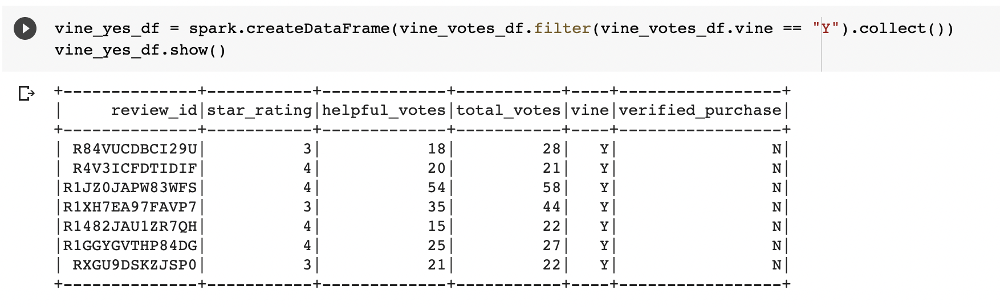
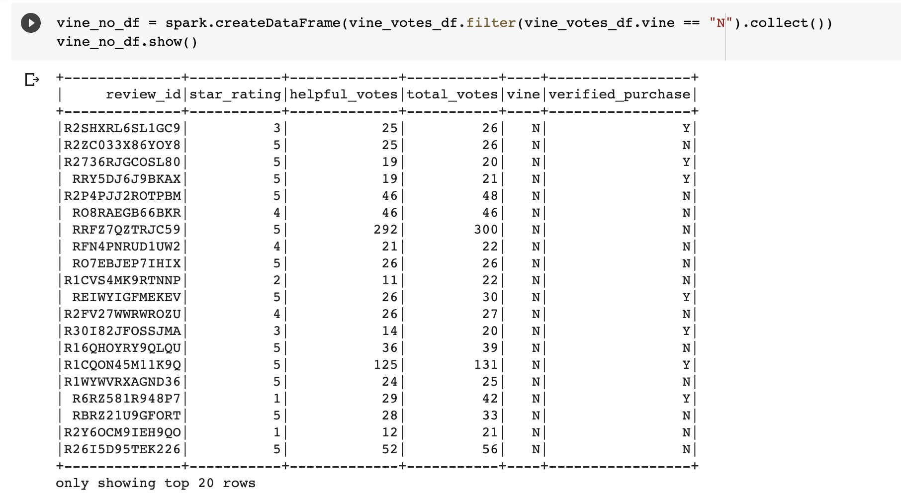

# Amazon_Vine_Analysis

## Overview

The purpose of this analysis was to analyze Amazon Music rating data to determine whether a product's participation in the Vine program generated more or less Five Star reviews for the product. 

## Results

In order to perform our analysis, we first imported the Music data into a Pyspark dataframe. Next, we trimmed the dataframe to include only columns relevant to our analysis. We then applied a number of filters on the Amazon Music data. First, we filtered for only the rows where the total votes for a product was greater than 20. This ensured the products we reviewed were somewhat popular and thus relevant to our analysis. Next, we filtered for the product rows where at least 50% of total votes were considered helpful votes. From there, we split the remaining rows into two different dataframes: the products that were a part of the Vine program, and those that were not. 

- Number of Vine and Non-Vine Reviews

After our filters were applied, we were left with just 7 Vine reviews. There were 105,979 Non-Vine reviews. Snapshots of these dataframes are shown below: 

Vine Reviews: 

Non-Vine Reviews:

- Number of Five Star Reviews

Of our 7 Vine reviews, 0 of them were Five Star reviews. Of our 105,979 Non-Vine reviews, 67,580 of them were Five Star reviews.

- Percentage of Reviews Receiveing Five Stars

Of the Vine reviews, 0% were Five Star reviews. Of the Non-Vine reviews, 63.8% were Five Star reviews. 

## Summary
After all our filters were applied, we were left with a very small number of Vine reviews (only 7). This was probably too small of a representative sample to accurately guage the amount of Five Star reviews for Vine products. But if we were to interpret our data based solely on the results of our filters, it seems that being a part of the Vine program actually hinders a products chances of receiving a Five Star review. 0% of Vine products got Five Stars, while 63.8% of Non-Vine products received Five Stars. There certainlly seems to be no positivity bias for reviews in the Vine program based on these figures. 

This analysis should be performed again with the filteres changed to include a greater number of products in the Vine program. This would allow for a more accurate representation of the amount of Five Star reviews. We could either lower the total number of votes required, or lower the percentage of helpful votes required. 

Please see the .ipynb files included in this repository to view the methodology used in our analysis. 
